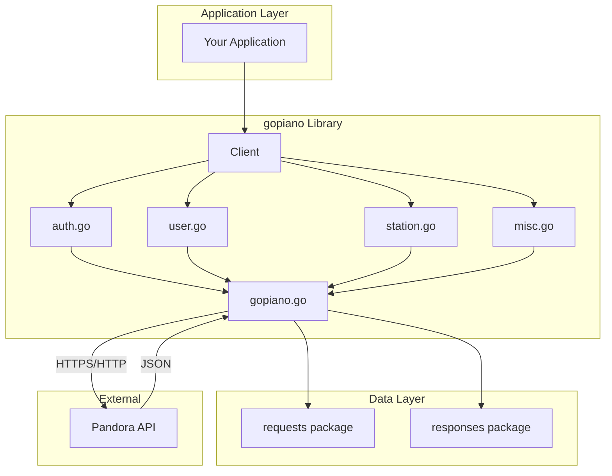
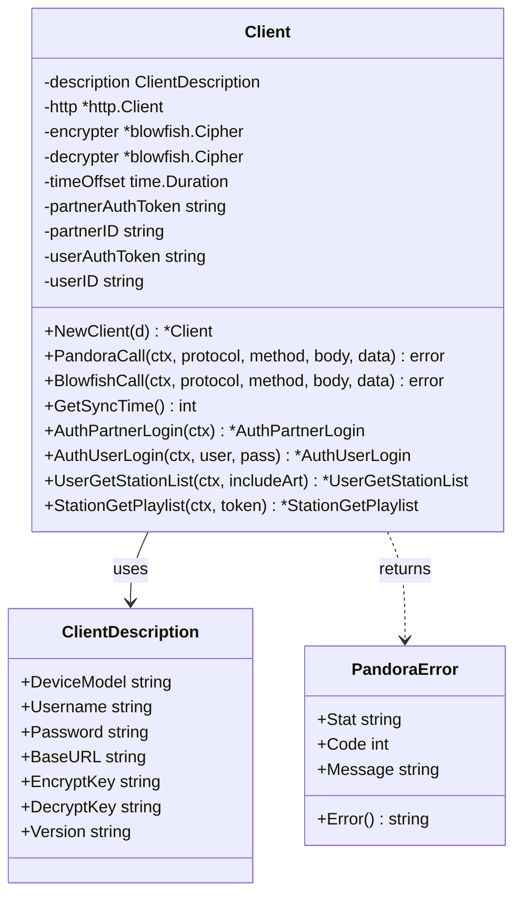
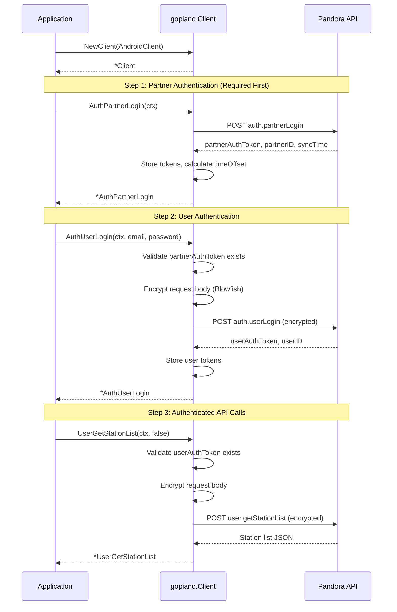
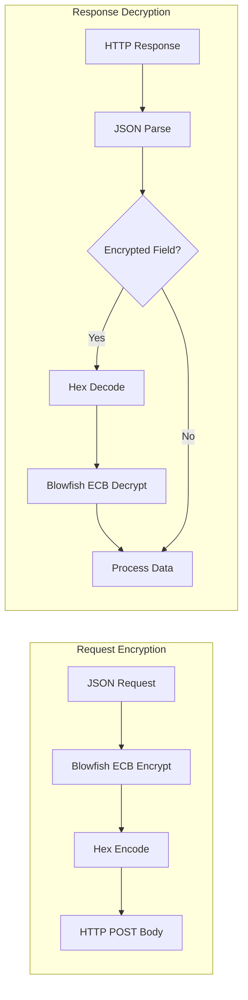
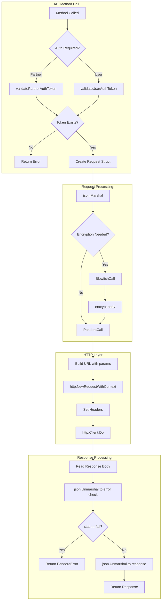
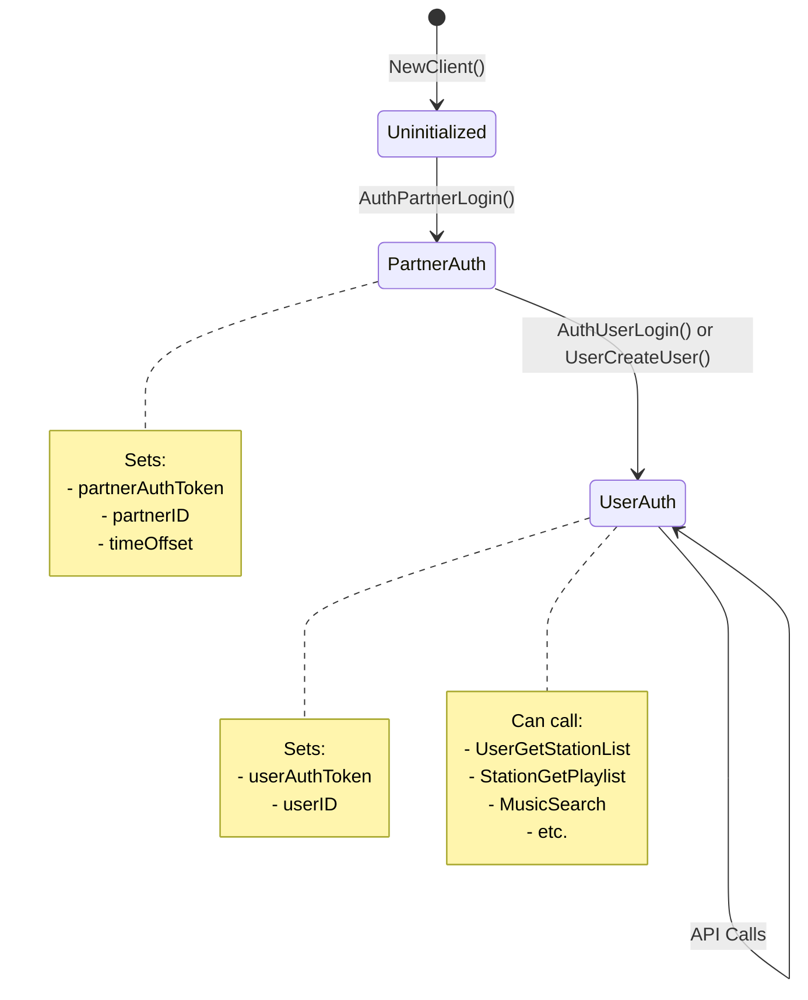
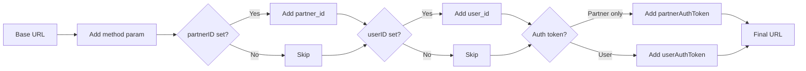
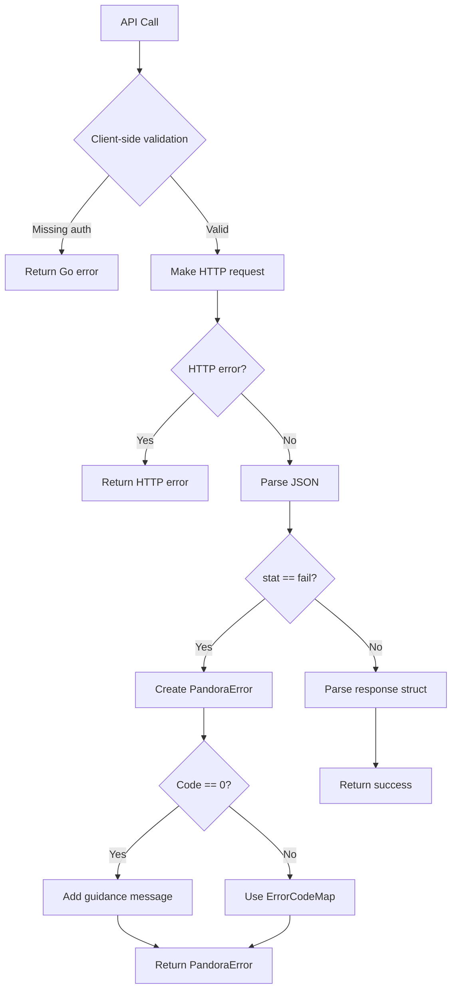
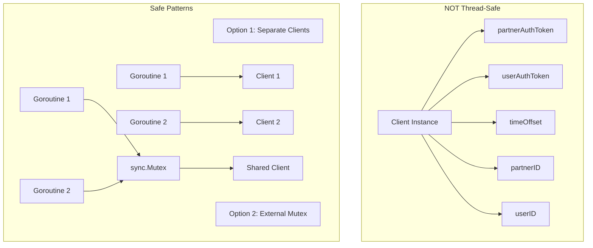
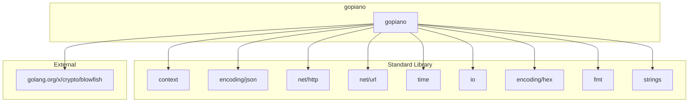

# gopiano Architecture

This document describes the architecture, design patterns, and internal workings of the gopiano library.

## System Overview



## Package Structure

```
github.com/unclesp1d3r/gopiano/
├── gopiano.go          # Core client, encryption, HTTP calls
├── auth.go             # Authentication methods
├── user.go             # User-related methods
├── station.go          # Station management methods
├── misc.go             # Music search, bookmarks, track info
├── requests/
│   └── requests.go     # Request data structures for JSON marshaling
└── responses/
    └── responses.go    # Response data structures for JSON unmarshaling
```

## Component Diagram



## Authentication Flow



## Encryption Architecture

The Pandora API uses Blowfish encryption in ECB (Electronic Codebook) mode for request bodies.



### Encryption Details

- **Algorithm**: Blowfish cipher
- **Mode**: ECB (Electronic Codebook)
- **Key Size**: Variable (provided by ClientDescription)
- **Encoding**: Hex encoding for transport

```go
// Encryption process (simplified)
func (c *Client) encrypt(data string) string {
    chunks := []string{}
    for i := 0; i < len(data); i += 8 {
        var buf, crypt [8]byte
        copy(buf[:], data[i:])
        c.encrypter.Encrypt(crypt[:], buf[:])
        chunks = append(chunks, hex.EncodeToString(crypt[:]))
    }
    return strings.Join(chunks, "")
}
```

## Request/Response Flow



## State Management

The `Client` struct maintains authentication state across API calls:



## URL Construction

API calls construct URLs with query parameters:

```
https://tuner.pandora.com/services/json/?method={method}&partner_id={id}&user_id={id}&auth_token={token}
```



## Error Handling Strategy



## Concurrency Considerations



## Dependencies



## Design Decisions

### 1. Thin Wrapper Approach

The library is intentionally a "thin wrapper" that mirrors the Pandora API exactly:

- Request/response structs match API JSON structure
- Method names match API method names
- No business logic abstraction

### 2. Context Support

All API methods accept `context.Context` as the first parameter:

- Enables request cancellation
- Supports timeouts
- Allows request tracing

### 3. Client-Side Validation

Authentication state is validated before making API calls:

- Prevents cryptic server errors
- Provides actionable error messages
- Fails fast on misuse

### 4. Blowfish Encryption

Uses deprecated `golang.org/x/crypto/blowfish` package:

- Required by Pandora's API protocol
- Not a security concern (API requirement, not design choice)
- Annotated with `//nolint:staticcheck`

### 5. Separation of Concerns

- `gopiano.go`: Core HTTP and encryption infrastructure
- `auth.go`: Authentication methods
- `user.go`: User management methods
- `station.go`: Station operations
- `misc.go`: Search, bookmarks, track info
- `requests/`: Data structures for outgoing requests
- `responses/`: Data structures for incoming responses
